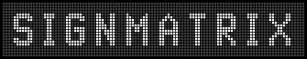
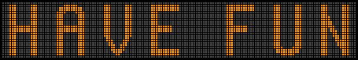

# Signmatrix 

This is a React-based interface for configuring and generating LED dest signs.

This frontend uses the [Signmatrix backend](https://github.com/itzzmarkus/Signmatrix-backend) which in turn is forked from chrislo27's [dotmatrix](https://github.com/chrislo27/dotmatrix/). 

To install, clone this repo, `npm install`, and `npm run dev`. Ensure the Signmatrix backend is running.

This work is licensed under APGLv3.

